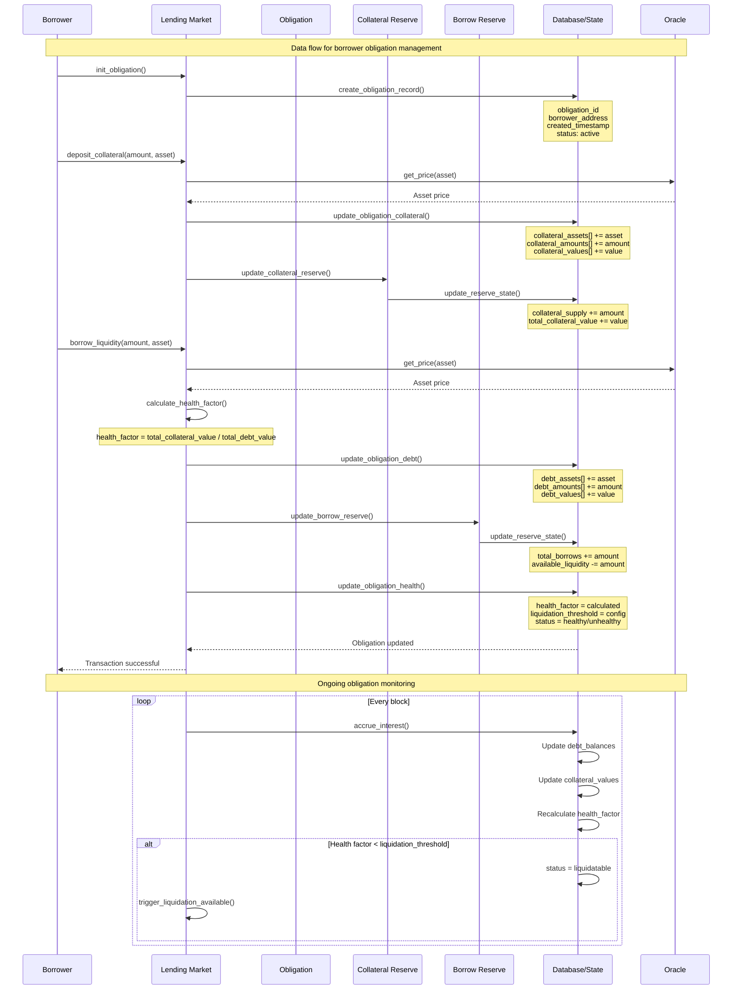

# MVP Sequence Diagrams: Lending Protocol Data & Money Flow

## Overview

This document provides sequence diagrams for the data flow and money flow in a lending protocol, focusing on the interactions between borrowers, lenders, and the protocol infrastructure. The diagrams capture the usage of obligation reserves and lending markets, showing what happens when liquidity enters the market and when borrowers create obligations.

## Architecture Components

- **Lending Market**: The primary protocol contract managing reserves and obligations
- **Reserve**: Individual asset pools with liquidity, borrow positions, and risk parameters
- **Obligation**: A borrower's position containing collateral and debt across multiple reserves
- **Lender**: Supplies liquidity to reserves in exchange for interest
- **Borrower**: Deposits collateral and borrows against it
- **Oracle**: Provides price feeds for collateral and borrowed assets
- **Liquidator**: Monitors and liquidates unhealthy positions

---

## Diagram 1: Lender Money Flow - Entering the Market

This diagram shows the complete flow when a lender supplies liquidity to a reserve, including interest accrual and potential yield farming.


---

## Diagram 2: Lender Data Flow - Market Entry

This diagram shows the data structures and state changes when a lender enters the market.


---

## Diagram 3: Borrower Money Flow - Creating Obligation

This diagram shows the complete flow when a borrower creates an obligation, deposits collateral, and borrows against it.


---

## Diagram 4: Borrower Data Flow - Obligation Management

This diagram shows the data structures and state changes when a borrower manages their obligation.



---

## Key Data Structures

### Reserve State
```rust
struct Reserve {
    // Liquidity management
    available_liquidity: u64,
    total_supply: u64,
    total_borrows: u64,
    
    // Interest accrual
    supply_index: u128,
    borrow_index: u128,
    last_update_timestamp: i64,
    
    // Risk parameters
    ltv: u16,
    liquidation_threshold: u16,
    liquidation_bonus: u16,
    
    // Caps and limits
    borrow_cap: u64,
    deposit_cap: u64,
    
    // Farm integration
    farm_address: Option<Pubkey>,
    farm_balance: u64,
}
```

### Obligation State
```rust
struct Obligation {
    // Borrower info
    borrower: Pubkey,
    created_at: i64,
    status: ObligationStatus,
    
    // Collateral tracking
    collateral_assets: Vec<Pubkey>,
    collateral_amounts: Vec<u64>,
    collateral_values: Vec<u64>,
    
    // Debt tracking
    debt_assets: Vec<Pubkey>,
    debt_amounts: Vec<u64>,
    debt_values: Vec<u64>,
    
    // Health metrics
    health_factor: u64,
    liquidation_threshold: u64,
}
```

### Supply Position
```rust
struct SupplyPosition {
    lender: Pubkey,
    reserve: Pubkey,
    collateral_amount: u64,
    supply_index_snapshot: u128,
    last_update_timestamp: i64,
}
```

---

## Money Flow Summary

### Lender Flow
1. **Entry**: Lender supplies liquidity → Reserve receives tokens → Collateral tokens minted
2. **Interest**: Continuous accrual → Supply index updates → Position value grows
3. **Yield**: Optional farm integration → Excess liquidity deployed → Additional yield earned
4. **Exit**: Collateral tokens burned → Reserve liquidity returned → Interest paid

### Borrower Flow
1. **Setup**: Obligation created → Collateral deposited → Collateral value tracked
2. **Borrow**: Loan requested → Health factor calculated → Liquidity borrowed
3. **Monitoring**: Continuous health checks → Interest accrual → Position monitoring
4. **Management**: Repayments → Additional collateral → Debt reduction

### Protocol Flow
1. **Fees**: Protocol fees collected → Treasury balance increased
2. **Risk**: Health monitoring → Liquidation triggers → Bad debt prevention
3. **Liquidity**: Reserve management → Farm integration → Yield optimization
4. **Governance**: Parameter updates → Risk management → Protocol evolution

---

## Integration Points

- **Oracle Integration**: Price feeds for all assets
- **Farm Integration**: Yield optimization for excess liquidity
- **Liquidation System**: Automated position monitoring and liquidation
- **Governance**: Parameter updates and risk management
- **Analytics**: Position tracking and protocol metrics

This MVP provides a comprehensive view of the lending protocol's data and money flows, showing how lenders and borrowers interact with the system and how the protocol manages risk and liquidity.
